# The-Simpsons-Ultimate-Quiz

The Simpsons Ultimate Quiz delivers an entertaining and fun experience for users interested in exploring the fascinating world of The Simpsons. With its engaging content, user-friendly interface and interactive features. The quiz serves as an enjoyable platform for Simpsons enthusiasts to test their knowledge and learn new facts.

Players recieve a score at the end with a message.

Players have the option to take quiz again.

### User Goals
User friendly navigation.
Non distracting background.
Opportunity to provide feedback.
Clear instructions written in plain English.
Relevant questions in the quiz.
Fair scoring system.

### User Stories
As a user, I want my knowledge to be challenged.
As a user, I want to be able to test my knowledge at different levels.
As a user, I want to receive immediate feedback on my quiz answers.
As a user, I want the instructions to be clear, concise and easily accessible.
As a user, I want navigation to be intuitive.
As a user, I want the score system to be transparent.
As a user, I want to be able to use website on range of devices.
As a user, I want to be able to easily contact content creators for feedback or changes.
As a user, I want the content to be accessible for anyone with diverse needs.

### Website Goals and Objectives
Provide entertainment and enjoyment for users whilst testing their knowledge.
Include various questions on simpsons characters.
Attract wide audience, including animation enthusiasts, casual viewers, and fans of popular animated series the simpsons.
Offer useful and accurate content that entices user to spend time on website.
Invite users to provide feedback.
Integrate accessibility features with high accessibility rating and diverse user audience.
Increase overall website traffic by increasing rankings on search engine.

### Target Audience
Animation enthusiasts
Casual viewers
Students and educators
Online communities and fan groups

### Wireframes
Wireframes were designed using Balsamiq tool. Following best practices, mobile version was designed first, then tablet and lastly the laptop view. There are some deviations from wireframes in the live version of the quiz. It is one page website to enhance the logical flow. 

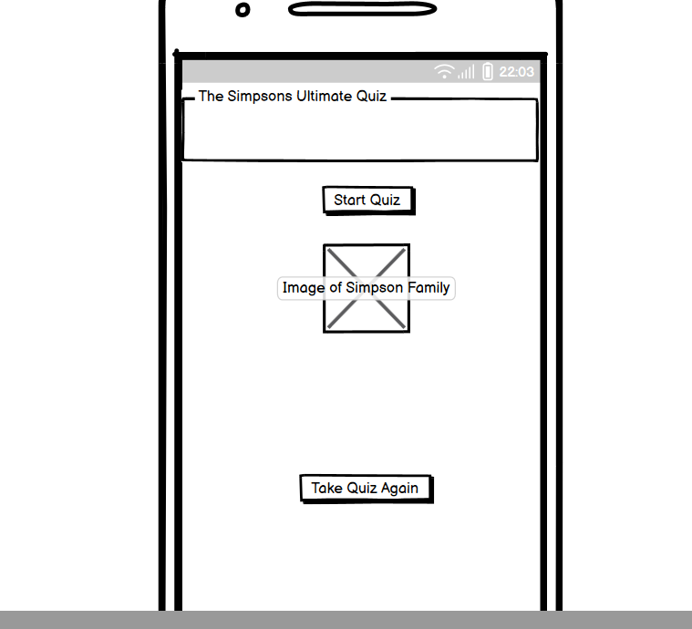
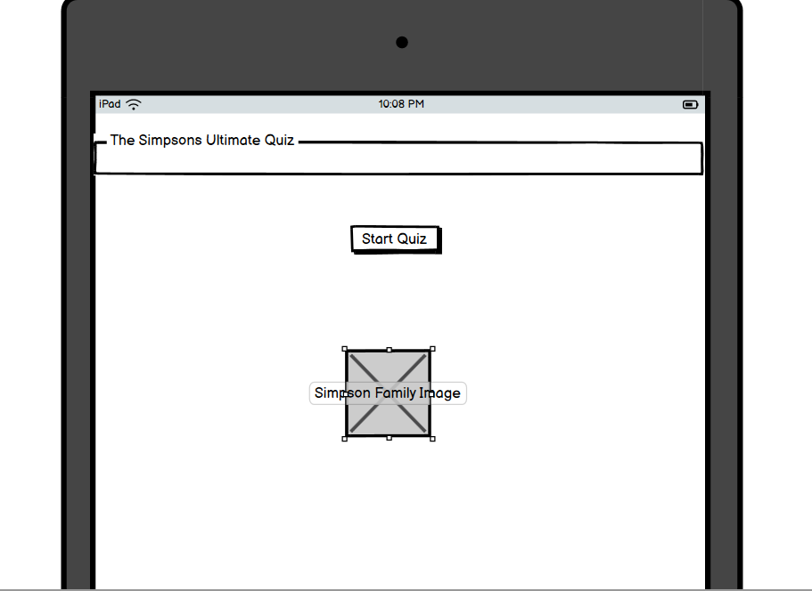
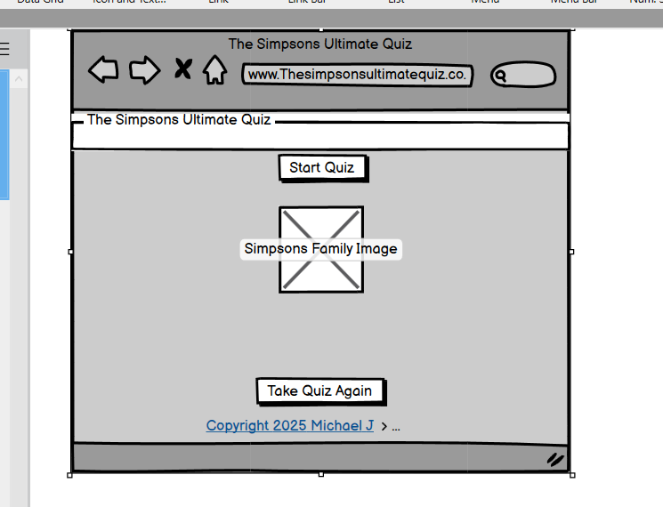

### Design Choices
Typography
The font family chosen for The Simpsons Ultimate Quiz was Akbar. It is a sans-serif font with a rounded appearance and a modern feel. Lato also has a clean and easy-to-read style, making it suitable for both print and web design.

### Images
Background image is displayed just underneath the start button. It displays the simpson family cartoon characters. The aim was for the background image to complement the subject matter of the quiz.

### Responsivenes
My website is responsive to different layouts depending on the size of the viewport have been included in the CSS media queries. This allows visitors to experience the website as I intended on device types and screen sizes. The breakpoints I am using are from Bootstrap.

| Breakpoints | Class infix | Dimensions |
|-------------|-------------|------------|
| XS          | (Extra Small) | <576px   |
| S           | (Small)       | >576px   |
| M           | (Medium)      | >768px   |
| L           | (Large)       | >992px   |
| XL          | (Extra Large) | >1200px  |

### Features
Layout is easy to use and adheres to the best practices in formatting and styling. 

### Existing Features
Header
This webpage has a header consistent across all screen sizes. The heading is yellow color so they blend in well and do not distract the quiz players.

Header All Screen Sizes

### Feedback
Users have an option to submit feedback by choosing a button. All fields are required and verified by the code.

### Landing View
The quiz is built on one page to get the best performance. The page consists of quiz name, welcome message and start button. All buttons have the same color. Once they are playing, questions are from APIfetched based. This feature accommodates users with varying levels of knowledge and expertise in the simpsons. For consistency purposes, home screen is the same across all devices.

### Question View
Questions are multiple choice and displayed one by one. The question body and 4 possible answers is displayed.

Under the question choices, users can also see the level selected and the number of answers as well.

### Final Score View
Final score view displays a message and a final score.

### Footer
To continue with simpson theme, footer is very simple with writing and a copyright symbol at the bottom.

Footer All Screen Sizes

### 404 Page
In a scenario where the link may be broken, 404 page has a built in html link that brings you back to the homepage.

### Future Enhancements
Multiple player option.
Online scoreboard that includes all players.
Share results on Social Media.
Option to store the progress and return to the quiz at a later time, allowing to finish it at user's pace and not lose any of the questions already completed.
Broaden range of simpson topics such as principles of animation, software tools, and industry best practices.
Provide hints or additional resources for challenging questions.
Time-adjustable quiz where player can select a time limit for each question, all questions or have no limitless time to complete.

### Technologies Used
Languages
HTML
CSS
JS
Dev Tools
GitHub
Balsamiq
W3C HTML Validation Service
W3C CSS Validation Service
WAVE Accessibility Tool

### Colour Scheme

My colour scheme was in keeping with the Simpsons theme.
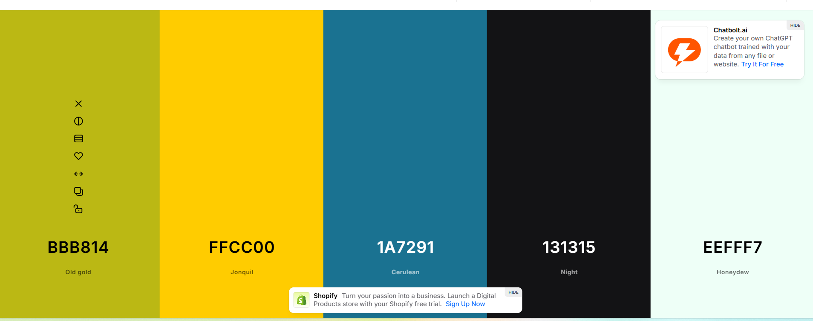
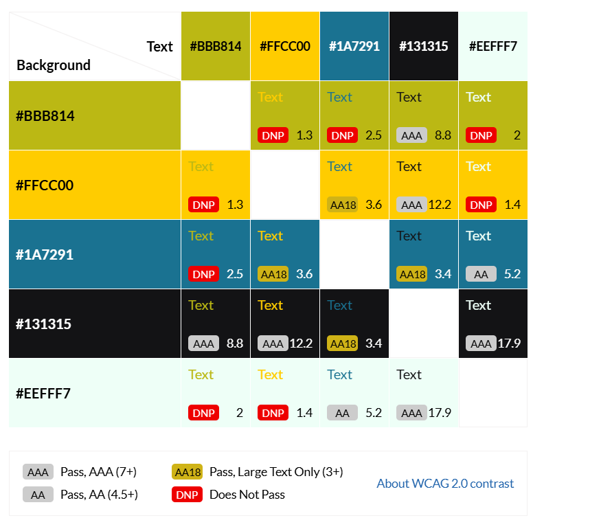

### Images
Image was from Googlepics

### Testing
Bugs
The quiz was thoroughly tested. I have recorded the manual testing in other parts of this document. I have used console logs to ensure JavaScript is running as expected in the background. 3 major bugs were identified and rectified.

### Bug	Status	Description	Steps To Resolve
Player Scores array not updating	Fixed	New player scores not adding to the player score array. The same 5 scores displaying all the time.	Wrong method used. Score was being added to the ed of Array which is fixed size. Updated JS code to add score to the beginning of Array and sort the scores accordingly.
Console Error - SEND button	Unresolved	When feedback form button SEND is clicked, console error appears in console. Uncaught TypeError: Cannot read properties of null (reading 'addEventListener')
    at HTMLDocument. It does not affect the functionality of the form as the acknowledgement page still displays.	There two forms being used in html file and button types are clashing. It needs additional JS event listeners to handle the SEND button. This was out of scope for this part of the project as the form is not being handled in the backend.

### Responsiveness Tests
To test the responsiveness, I have launched the website very early on. I followed the mobile-first strategy and verified all of my modifications using the DevTools browsers for Google Chrome and Microsoft Edge. Deployed versions were tested using the external website Responsive Design Checker. The Am I Responsive website was another external source that was used to obtain a unified view of different device breakpoints.

I have also used Google Chrome's Mobile Simulator extension to evaluate the responsiveness of even more specialized devices. Device samples were examined for navigation, element alignment, content layout, and functionality concerns at different breakpoints. I moved the hamburger icon from the left to the right to enhance user experience as a result of the testing.

### Final Test Results:

 |Size |	Device Example |	Navigation |	Element Alignments |	Content Placement |	Functionality |	Notes |
 | --- | ----------------- | ------------- | --------------------- | -------------------- | ------------- | ----- |
 | SM  | Samsung Galaxy S20|	Good |	Good |	Good |	Good	| N/A |
 | M   | ipad      |   Good | Good  | Good | Good | N/A  |
 | XXL   | Desktop |	Good  | Good | Good | Good | N/A |

### Code Validation
HTML
I have used W3C HTML Validation Service. I have tested the html file and it came back without errors.
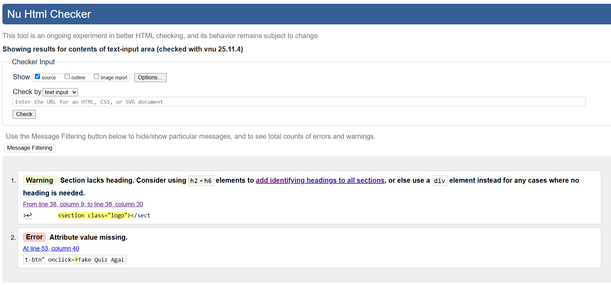

Main Quiz Page:
W3C HTML Validator

CSS
CSS code for the webpage was validated on W3C CSS Validation Service. There were no errors relating CSS code for this website.

W3C CSS Validator
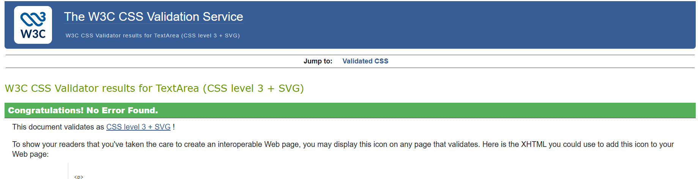

JavaScript
JS code was validated on JSHint. No errors identified.

JS Validation Image
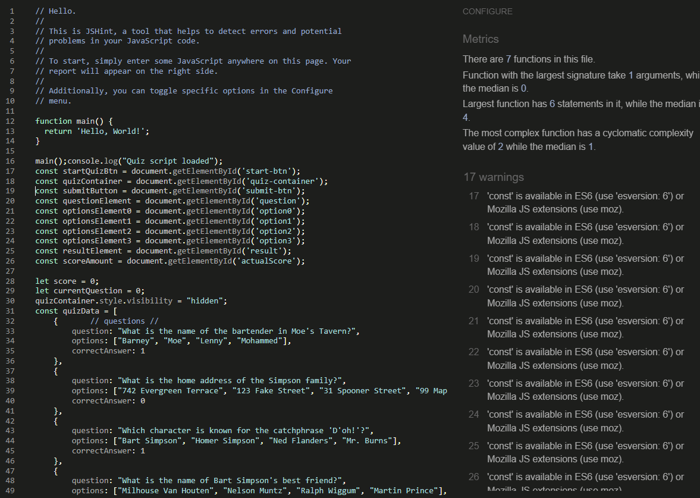

### User Story Testing
| User Story  |	Result |	Pass |	Screenshot |
| ----------  | ------ | ------- | ----------- |
| As a user, I want my knowledge to be challenged. |	Quiz fetches questions from API so they do not repeat frequently. |	Yes	| Question View |
| As a user, I want to be able to test my knowledge on The Simpsons. |	User can choose from ultiple questions. |	Yes |	Level View |
| As a user, I want to receive a feedback score on my quiz answers. |	Yes |	Question Answers |
| As a user, I want the instructions to be clear, concise and easily accessible. |	Instructions are easy to understand with the buttons. |	Yes  |	Instructions View |
| As a user, I want navigation to be intuitive. |	Buttons named logically	| Yes	| Start View |
| As a user, I want the score system to be transparent. |	Feedback on their answers | Yes |	Numbered Score View |
| As a user, I want to be able to use website on range of devices. |	Quiz is fully functional on all devices	| Yes	| Mobile View |
| As a user, I want to be able to easily contact content creators for feedback or changes. |	Feedback form available |	Yes |	Feedback Form |
| As a user, I want the content to be accessible for anyone with diverse needs. |	Passed all accessibility tests	| Yes	| See Accessibility Testing section |

### Automated and Manual Testing
Automated testing uses scripts and tools to execute tests automaticly, comparing actual results to expected outcomes.
It is fast, reliable, and great for repetitive tasks, like regression testing or checking basic functionality.
Automated testing is used on every code change to catch bugs early, Large Test Suites for when you have many tests and
repetitive tasks e.g login/logout flows.
Manual testing is when Human testers explore the software trying to break it or fix issues.
It's flexible, creative, and catches UI/UX issues or unexpected behaviour. It is used when there are new features, or to 
check for usability issues and old browsers ect.

### Feature Testing
This website was extensively tested for functionality using both Chrome and Edge developer tools.

Every feature was manually tested using the test script and outcomes recorded.

### Accessibility Testing
I have used web accessibility evaluation tool WAVE Tool which helps to determine if web content is accessible to individuals with diverse needs. No issues were raised.

### WAVE

In addition to WAVE testing, I have tested my webpage for color contrast accessibility on Color Contrast Accessibility Validator.
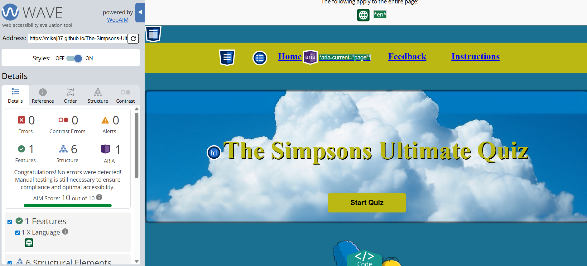

### Lighthouse Testing
The Ultimate Animation Quiz has been tested in the Chrome Dev Tools and Microsoft Edge Dev Tools using Lighthouse Testing tool which inspects and scores the website for the following criteria:

Performance - how quickly a website loads and how quickly users can access it.
Accessibility - test analyses how well people who use assistive technologies can use your website.
Best Practices - checks whether the page is built on the modern standards of web development.
SEO - checks if the website is optimised for search engine result rankings.
Tests for Desktop on Lighthouse Chrome: Lighthouse-Desktop-Chrome-Index

Tests for Mobile on Lighthouse Chrome: Lighthouse-Mobile-Chrome-Index

Tests for Desktop Lighthouse Edge: Lighthouse-Desktop-Edge-Index

Tests for Mobile on Lighthouse Edge: Lighthouse-Mobile-Edge-Index

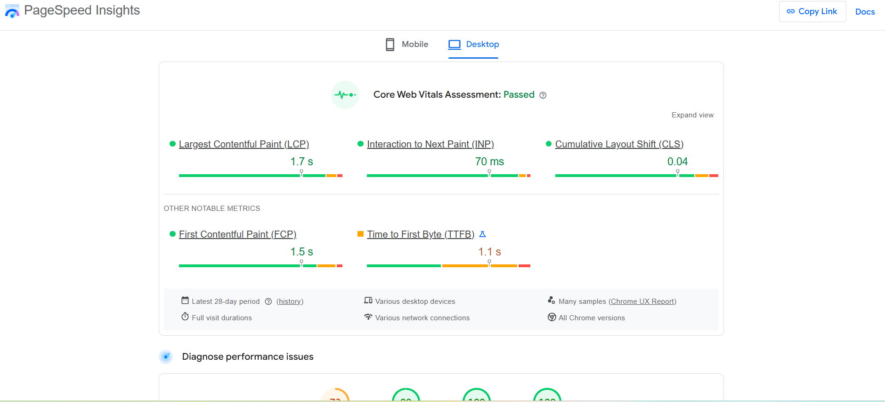
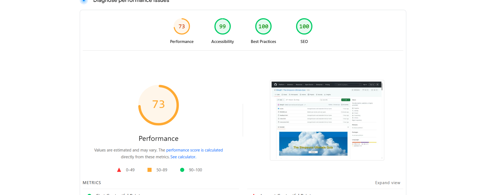
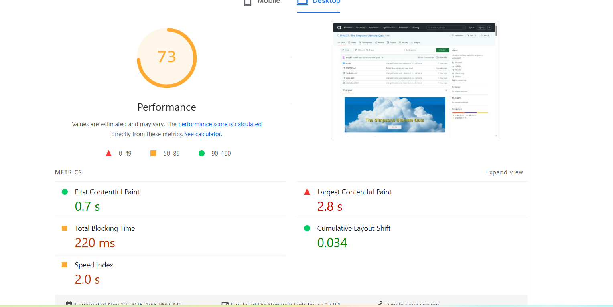

### Browser Testing
The Simpsons Ultimate Quiz website was examined for bugs and malfunctions using a variety of browsers. Opera, Firefox, Google Chrome, and Microsoft Edge were selected for thorough testing. Due to its age, Internet Explorer's initial results were quite subpar. On an iPad and an iPhone, I tested Safari. For the website's final version, no significant problems were discovered on the top 4 browsers. The test findings were verified.

### Deployment
To deploy the project
The Simpson Ultimate Quiz was deployed early in the process to GitHub pages via the following steps:

Navigate to the repository on GitHub and click on Settings.

In the side navigation and select Pages.

In the None dropdown and choose Main.

Click on the Save button.

The website is now live at https://mikej87.github.io/The-Simpsons-Ultimate-Quiz/

Any changes required to the website, they can be made, committed and pushed to GitHub.

To fork the project
Forking the GitHub repository allows you to create a duplicate of a local repository. This is done so that modifications to the copy can be performed without compromising the original repository.

Log in to GitHub.
Locate the repository.
Click to open it.
The fork button is located on the right side of the repository menu.
To copy the repository to your GitHub account, click the button.
To clone the project
Log in to GitHub.
Navigate to the main page of the repository and click Code.
Copy the URL for the repository.
Open your local IDE.
Change the current working directory to the location where you want the cloned directory.
Type git clone, and then paste the URL you copied earlier.
Press Enter to create your local clone.

### Feedback, advice and support:

Spencer Bariball
Quiz Questions

### Code inspiration and learning content:

Love Maths Project
W3C Schools
StackOverflow
YouTube Channels for Quiz functionality and API Fetch:

### Visual content:

Coolors
Contrast Grid

### Images:

Googlepics

